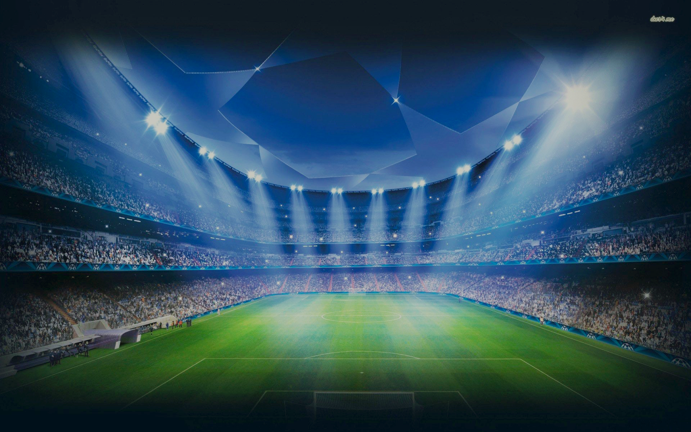

# ⚽ Calcio-Europeo

  

### 📃 Project specifications

European football is made up of the 5 major European leagues, each of which is made up of various series
(e.g. Italian league: Serie A and Serie B). 
In each series there are a maximum of 8 teams, made up of a number of players that varies for each
team and which must be greater than 11. 
Each team is characterized by a score in the standings, a location (City, street, house number) and a balance in
euro for the market. 
The players are divided into 4 roles (goalkeepers, defenders, midfielders and forwards) and are characterized by
a personal data, an age, a sponsor (not necessary) and a market value expressed in euros. 
Each series has a calendar showing all the matches of the season, played and still from
to play. For each match there is the matchday number and the possible result. 
From a dedicated web page a user can:
- view the series of the championship;
- view the teams of a series;
- view the players of a team divided by role and in increasing order of age;
- view the ranking and the schedule of a series;
- view the results of a day of a series;
- view a single meeting;
- view the most famous sponsor of a series;
- view all players under a certain age in ascending order of age;
- view the matches with results with 3 or more goal difference played in a series;
- view the most frequent nationalities in a team of a series;
- view the players of a certain nationality in a series;
- view the players of a certain role in a series;
-add a result of a match not yet played;
-Transfer a player from one team to another respecting the available balance of a team.

### How it works?

In the Home of the site there are 4 main buttons and a settings button from which the administrators
can update matches and points in the standings and random generation of
match scores.  
The 4 main buttons are, in order, search, edit, transfer and browse leagues.
<b>Search</b>: you enter a section where the user can perform 6 types of searches within the database
- Match, allows you to view the result of a selected match
- Players by Nationality, allows you to view all players of a certain nationality in
a certain series
- Matchday, allows you to view all the matches of a given series in a given series
day
- 3 or more goal difference, allows you to view all matches with 3 or more goal difference in one
certain series
- Players per role, allows you to view all the players of a certain role in one
certain series
- Players by age, allows you to view all players under a certain age
 
<b>Edit</b>: you enter a section where the user can add results to matches not yet played
 
<b>Transfers</b>: you enter a section where the user can make player transfers between all
European football teams respecting the balance of the teams and the values of the players
 
<b>Display leagues</b>: section in which the user views the 5 leagues of which he can view the series
by pressing a button. After pressing one of these buttons he has to choose which series to display,
once chosen, it will display all the teams of the selected series and through 2 blue buttons will be able to
choose whether to display the ranking and calendar of the series.
